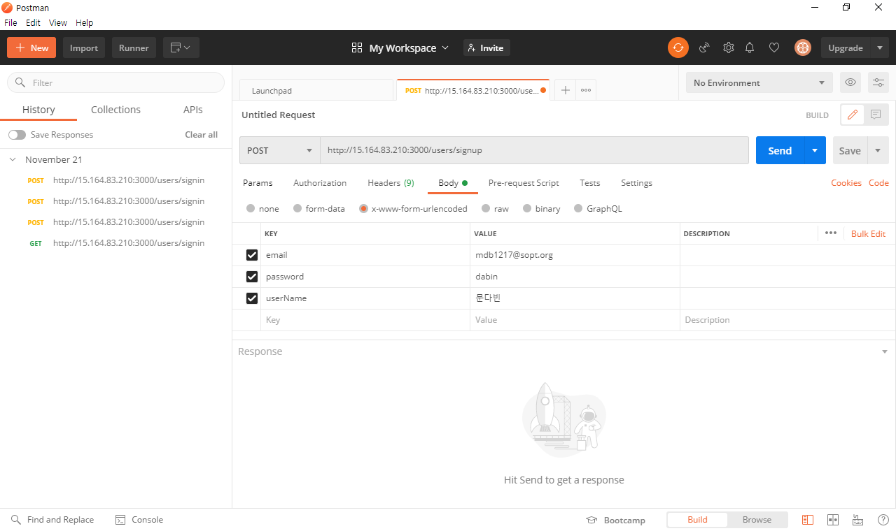
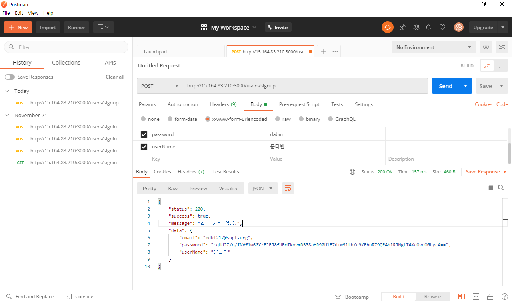
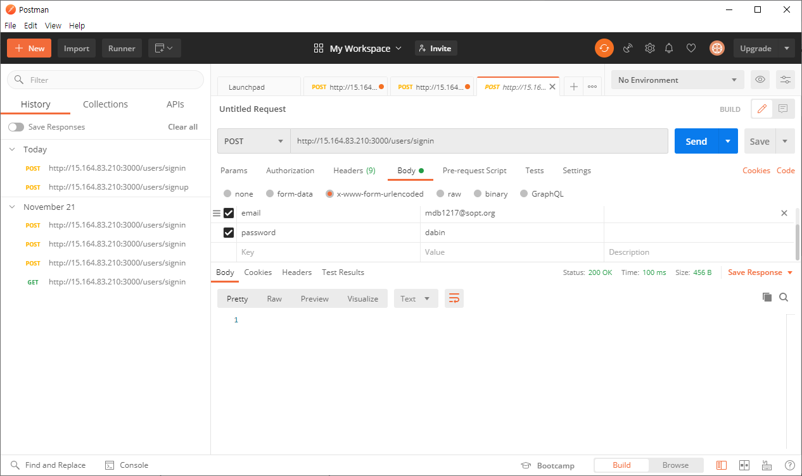
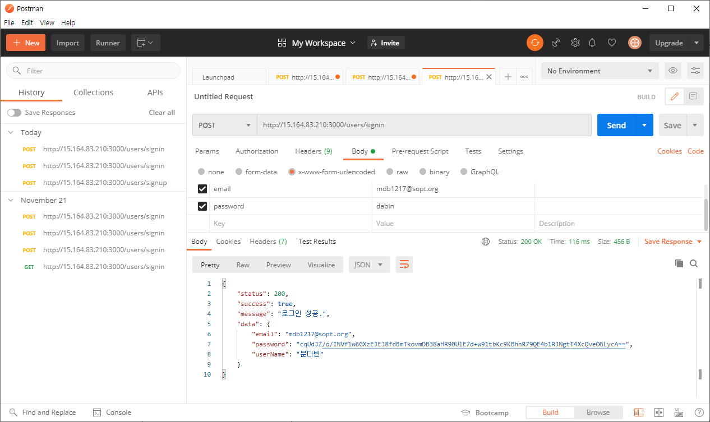

# SOPT 27기 안드로이드 과제

UPDATE DATE : 2020.12.04

## 목차

[1주차 과제](https://github.com/ONSOPTFunAndroid/mdb1217-ONSOPTAssignment/blob/week3/README.md#1%EC%A3%BC%EC%B0%A8-%EA%B3%BC%EC%A0%9C)

[2주차 과제](https://github.com/ONSOPTFunAndroid/mdb1217-ONSOPTAssignment/blob/week3/README.md#2%EC%A3%BC%EC%B0%A8-%EA%B3%BC%EC%A0%9C)

[3주차 과제](https://github.com/ONSOPTFunAndroid/mdb1217-ONSOPTAssignment/blob/week3/README.md#3%EC%A3%BC%EC%B0%A8-%EA%B3%BC%EC%A0%9C)

[6주차 과제](https://github.com/ONSOPTFunAndroid/mdb1217-ONSOPTAssignment/blob/week3/README.md#3%EC%A3%BC%EC%B0%A8-%EA%B3%BC%EC%A0%9C)

## 1주차 과제


   **실행 화면**

  

​																	필수과제

  

​															필수과제 + 심화과제1

   

​																	심화과제2


**주요코드**

- 필수과제 

  

  **MainActivity.kt**

  - 로그인 화면

    ```kotlin
    override fun onCreate(savedInstanceState: Bundle?) {
           ...
           button2.setOnClickListener{
               val intent = Intent(this, SignUpActivity::class.java)
               startActivityForResult(intent, 1001)
           }
    }
    ```

    버튼을 누르면 회원 가입 창으로 넘어가게 함

  

  **SignUpActivity.kt**

  - 회원가입 창

    ```kotlin
    override fun onCreate(savedInstanceState: Bundle?) 
           	...
            button.setOnClickListener{
                var name : String = editTextTextPersonName3.text.toString()
                var id : String = editTextTextPersonName4.text.toString()
                var pass : String = editTextTextPersonName5.text.toString()
    
               if(name.isNotEmpty() && id.isNotEmpty() && pass.isNotEmpty()){
            	   	Toast.makeText(this, "회원가입 완료!", Toast.LENGTH_SHORT).show()
          	     	val intent = Intent(this, MainActivity::class.java)
                   	...
                   	finish()
               }
                else {
                    Toast.makeText(this, "빈 칸이 있습니다", Toast.LENGTH_SHORT).show()
                }
            }
    }
    ```

    isNotEmpty()를 통해 빈 칸의 여부를 파악하고 빈 칸이 있으면, Toast message를 출력함.


- 성장 과제1

  **MainActivity.kt**	

  ```kotlin
  override fun onActivityResult(requestCode: Int, resultCode: Int, data: Intent?) {
      super.onActivityResult(requestCode, resultCode, data)
  
      if(resultCode == 1002) {
          if (data != null) {
              editTextTextPersonName.setText(data.extras?.getString("id"))
          }
          if (data != null) {
              editTextTextPersonName2.setText(data.extras?.getString("pass"))
          }
      }
  }
  ```

  onActivityResult함수를 override해서, SignUpActivity에서 받아온 값들을 각각 editText안에 넣어준다.

  

  **SignUpActivity.kt**

  ```kotlin
  override fun onCreate(savedInstanceState: Bundle?) {
          ...
          button.setOnClickListener{
              ...
              if(name.isNotEmpty() && id.isNotEmpty() && pass.isNotEmpty()) {
                  Toast.makeText(this, "회원가입 완료!", Toast.LENGTH_SHORT).show()
                  val intent = Intent(this, MainActivity::class.java)
                  intent.putExtra("name", name)
                  intent.putExtra("id", id)
                  intent.putExtra("pass", pass)
                  setResult(1002, intent)
                  finish()
              }
              ...
          }
      }
  ```

  intent.putExtra를 통해, 각각의 값(이름, id, password)들을 다시 mainActivity로 전달해준다.

  

- 성장 과제2

  **MainActivity.kt**	

  ```kotlin
   private fun saveData() {
          val pref = getSharedPreferences("pref", 0)
          val edit = pref.edit()
          if(editTextTextPersonName.text.toString().isNotEmpty() && editTextTextPersonName2.text.toString().isNotEmpty()) {
              edit.putString("id", editTextTextPersonName.text.toString())
              edit.putString("pass", editTextTextPersonName2.text.toString())
              edit.putBoolean("check", true)
              edit.apply()
          }
      }
  ```

  getSharedPreferences를 통해, id, password, check(로그인에 성공했는 지 여부)의 값들을 저장해준다.

  

  **MainActivity.kt**

  ```kotlin
  private fun loadData() {
      val pref = getSharedPreferences("pref", 0)
      if(pref.getBoolean("check", false)) {
          Toast.makeText(this, "자동로그인 완료", Toast.LENGTH_SHORT).show()
          val intent = Intent(this, SecondActivity::class.java)
          startActivity(intent)
      }
  }
  ```

  check의 값이 false가 아니라면, 자동로그인이 완료되었다는 토스트메시지와 함께 곧장 화면이 전환된다.

  

## 2주차 과제

**실행 화면**


​																						필수과제


​																						성장과제1


​																						성장과제2


**주요코드**

- 필수과제 

  

  **SampleViewHolder.kt**

  ```kotlin
  override fun onClick(v: View?) {
      val intent = Intent(v?.context, Detailed_Activity::class.java)
      v?.context?.startActivity(intent)
  }
  ```

  view를 클릭할 때마다 특정한 이벤트가 발생하게 하기위해, onClick을 override해준다. 클릭 시, intent를 통해, 세부설명이 있는 창으로 넘어가게 해준다.

  

  **SampleAdapter.kt**

  ```kotlin
  interface ItemClick
  {
      fun onClick(view: View, position: Int)
  }
  
  override fun onBindViewHolder(holder: SampleViewHolder, position: Int) {
          holder.onBind(data[position])
          if(itemClick != null)
          {
              holder.itemView.setOnClickListener { v ->
                  itemClick?.onClick(v, position)
              }
          }
      }
  ```

  interface를 구현해, 나중에 activity에서 adapter를 호출 시, onClick을 구현하게끔 해줬다.

  

  **SecondActivity.kt**

  ```kotlin
  class SecondActivity : AppCompatActivity() {
      private lateinit var sampleAdapter: SampleAdapter
      override fun onCreate(savedInstanceState: Bundle?) {
          super.onCreate(savedInstanceState)
          setContentView(R.layout.activity_second)
  
          sampleAdapter = SampleAdapter(this)
  
          sampleAdapter.itemClick = object: SampleAdapter.ItemClick {
              override fun onClick(view: View, position: Int) {
                  val title: TextView = view.findViewById(R.id.item_title);
                  val subTitle: TextView = view.findViewById(R.id.item_subTitle);
                  val intent = Intent(view.context, Detailed_Activity::class.java)
                  intent.putExtra("title", title.text.toString())
                  intent.putExtra("subtitle", subTitle.text.toString())
                  setResult(1003, intent)
                  startActivity(intent)
              }
          }
          ...
  }
  ```

  onClick을 override해서 view에서 title과 subtitle의 값을 가져와, putExtra를 통해, 상세설명 activity로 넘겨줬다.(이 값들이 무엇이냐에따라 어떤 화면이 나올 지 달라지게 된다.)

  

- 심화과제1 

  **SampleAdapter.kt**

  ```kotlin
  override fun onCreateViewHolder(parent: ViewGroup, viewType: Int): SampleViewHolder {
      var view = LayoutInflater.from(context).inflate(R.layout.sample_item_list, parent, false)
      if(viewType == 1) {
          view = LayoutInflater.from(context).inflate(R.layout.grid_item_list, parent, false)
      }
      return SampleViewHolder(view)
  }
  
  fun setItemViewType(sw : Int) {
      changeViewType = sw
      notifyDataSetChanged()
  }
  
  override fun getItemViewType(position: Int) : Int{
      return changeViewType
  }
  ```

  onCreateViewHolder에서 viewType에 따라 inflate해주는 view가 달라지게 해줬다. 그 외에 viewType을 설정하는 setItemViewType과 viewType의 값을 가져오는 getItemviewType을 만들어줬다.

  

  **SampleAdapter.kt**

  ```kotlin
  switch2.setOnCheckedChangeListener{CompoundButton, onSwitch ->
      //  스위치가 켜지면
      if (onSwitch){
          sampleAdapter.setItemViewType(1)
          main_rcv.adapter = sampleAdapter
          main_rcv.layoutManager = GridLayoutManager(this, 2)
      }
      //  스위치가 꺼지면
      else{
          sampleAdapter.setItemViewType(0);
          main_rcv.adapter = sampleAdapter
          main_rcv.layoutManager = LinearLayoutManager(this)
      }
  }
  ```

  스위치버튼을 하나 만들어서 스위치가 켜지면, ViewType을 1(grid layout)으로 만들어줬고, 스위치가 꺼지면  ViewType을 0(linear layout)으로 만들어줬다.


- 심화과제2

  **ItemTouchHelperListener.kt**

  ```kotlin
  interface ItemTouchHelperListener {
      fun onItemMoved(from : Int, to : Int)
      fun onItemSwiped(position : Int)
  }
  ```

  interface를 만들어, 뷰의 아이템들이 이동할 때와, swipe될 때 구현 할 함수들을 미리 정의해놓았다.

  

  **ItemTouchHelperCallback.kt**

  ```kotlin
  class ItemTouchHelperCallback(private val listener: ItemTouchHelperListener) : ItemTouchHelper.Callback(){
  
      override fun getMovementFlags(recyclerView: RecyclerView, viewHolder: RecyclerView.ViewHolder): Int {
          val dragFlags = ItemTouchHelper.DOWN or ItemTouchHelper.UP or ItemTouchHelper.LEFT or ItemTouchHelper.RIGHT
          val swipeFlags = ItemTouchHelper.START or ItemTouchHelper.END
          return makeMovementFlags(dragFlags, swipeFlags)
      }
  
      override fun onMove(recyclerView: RecyclerView, viewHolder: RecyclerView.ViewHolder, target: RecyclerView.ViewHolder): Boolean {
          listener.onItemMoved(viewHolder!!.adapterPosition, target!!.adapterPosition)
          return true
      }
  
      override fun onSwiped(viewHolder: RecyclerView.ViewHolder, direction: Int) {
          listener.onItemSwiped(viewHolder!!.adapterPosition)
      }
  
      override fun isLongPressDragEnabled(): Boolean = true
  }
  ```

  ItemTouchHelper를 쓰기위해 callback에서 getMovementFlags, onMove, onSwiped, isLongPressDragEnabled(길게누르는 거 허용할 지 말지)를 override해줬다.

  

  **SampleAdapter.kt**

  ```kotlin
  override fun onItemMoved(from: Int, to: Int) {
      if (from == to) {
          return
      }
  
      val fromItem = data.removeAt(from)
      data.add(to, fromItem)
      notifyItemMoved(from, to)
  }
  
  override fun onItemSwiped(position: Int) {
      data.removeAt(position)
      notifyItemRemoved(position)
  }
  ```

  SampleAdapter에서 각각 아이템이 이동할 때(위치를 바꿔 줌)와 스와이프 할 때(삭제시켜줌) 실행해야할 함수를 구현하여주었다.
  
  
  
  ## 3주차 과제
  
  **실행 화면**

  

																	필수과제


**주요코드**

- 필수과제 

  **Adapter.kt, Adapter2.kt**

  ```kotlin
  class ViewPagerAdapter(fm : FragmentManager) : FragmentStatePagerAdapter(fm, BEHAVIOR_RESUME_ONLY_CURRENT_FRAGMENT) {
      var fragments = listOf<Fragment>()
  
      override fun getItem(position: Int): Fragment = fragments[position]
  
      override fun getCount(): Int = fragments.size
  }
  ```

  두 소스 모두 ViewPagerAdapter를 똑같은 형태(FragmentStatePagerAdapter를 상속받아서..)로 만들어 줬습니다. Adapter.kt는 탭 레이아웃의 전환에 사용하였고, Adapter2.kt는 bottom nevigation을 이용해서 전체 뷰를 전환할 때 사용했습니다.

  

​		**Fragment1.kt**

  ```kotlin
override fun onCreateView(
        inflater: LayoutInflater, container: ViewGroup?,
        savedInstanceState: Bundle?
    ): View? {
        // Inflate the layout for this fragment
        val view = inflater.inflate(R.layout.fragment_1, container, false)

        return view
    }

override fun onViewCreated(view: View, savedInstanceState: Bundle?) {
       	super.onViewCreated(view, savedInstanceState)

        viewpagerAdapter = ViewPagerAdapter(childFragmentManager)
        viewpagerAdapter.fragments = listOf(
            Fragment2(),
            Fragment3()
        )

        sample_tab_viewpager.adapter = viewpagerAdapter

        sample_tab.setupWithViewPager(sample_tab_viewpager)
        sample_tab.apply {
            getTabAt(0)?.text = "INFO"
            getTabAt(1)?.text = "OTHER"
        }

        sample_tab_viewpager.addOnPageChangeListener(object : ViewPager.OnPageChangeListener{
            override fun onPageScrollStateChanged(state: Int) {}
            override fun onPageScrolled(
                position: Int,
                positionOffset: Float,
                positionOffsetPixels: Int
            ) {}
            // ViewPager의 페이지 중 하나가 선택된 경우
            override fun onPageSelected(position: Int) {
                sample_tab.getTabAt(position)?.isSelected
            }
        })
    }
  ```

  탭 레이아웃이 들어가 있는 Fragment1.kt(프로필 화면 구현)의 코드입니다. activity에서 ViewPagerAdapter()를 구현할 때와는 다르게, ViewPagerAdapter(**childFragmentManager**) 이런 식으로 구현해줍니다. Fragment의 경우 Activity가 아니기 때문에 childFrgmentManager를 써줍니다. 
		

​		**RecyclerFragment.kt**

  ```kotlin
    override fun onCreateView(
        inflater: LayoutInflater, container: ViewGroup?,
        savedInstanceState: Bundle?
    ): View? {
        // Inflate the layout for this fragment
        return inflater.inflate(R.layout.activity_second, container, false)
    }

    override fun onViewCreated(view: View, savedInstanceState: Bundle?) {
        super.onViewCreated(view, savedInstanceState)

        sampleAdapter = activity?.let { SampleAdapter(it) }!!

        sampleAdapter.itemClick = object : SampleAdapter.ItemClick {
            override fun onClick(view: View, position: Int) {
                val title: TextView = view.findViewById(R.id.item_title);
                val subTitle: TextView = view.findViewById(R.id.item_subTitle);
                val intent = Intent(view.context, Detailed_Activity::class.java)
                intent.putExtra("title", title.text.toString())
                intent.putExtra("subtitle", subTitle.text.toString())
                startActivity(intent)
            }
        }

        val itemTouchHelperCallback = ItemTouchHelperCallback(sampleAdapter)
        val itemTouchHelper = ItemTouchHelper(itemTouchHelperCallback)
        itemTouchHelper.attachToRecyclerView(main_rcv)

        sampleAdapter.setItemViewType(0);
        main_rcv.adapter = sampleAdapter
        main_rcv.layoutManager = LinearLayoutManager(activity)

        switch2.setOnCheckedChangeListener { CompoundButton, onSwitch ->
            //  스위치가 켜지면
            if (onSwitch) {
                sampleAdapter.setItemViewType(1)
                main_rcv.adapter = sampleAdapter
                main_rcv.layoutManager = GridLayoutManager(activity, 2)
            }
            //  스위치가 꺼지면
            else {
                sampleAdapter.setItemViewType(0);
                main_rcv.adapter = sampleAdapter
                main_rcv.layoutManager = LinearLayoutManager(activity)
            }
        }

        sampleAdapter.data = mutableListOf(
            ProfileData("이름", "문다빈"),
            ProfileData("나이", "23"),
            ProfileData("파트", "안드로이드"),
            ProfileData("GitHub", "https://github.com/mdb1217"),
            ProfileData("Blog", "https://blog.naver.com/mdb1217"),
            ProfileData("Sopt", "www.sopt.org")
        )
        sampleAdapter.notifyDataSetChanged()

        button7.setOnClickListener {
            removeData()
            this.activity?.finish()
        }
    }

    private fun removeData() {
        val pref = this.activity?.getSharedPreferences("pref", 0)
        val edit = pref?.edit()
        edit?.remove("id")
        edit?.remove("pass")
        edit?.remove("check")

        edit?.apply()

        Toast.makeText(activity, "로그아웃 완료", Toast.LENGTH_SHORT).show()
    }
  ```

  2주차 과제 였던 RecyclerView를 구현한 RecyclerFragment.kt입니다. 위에서와 마찬가지로, RecyclerFragment는 activity가 아닌 Fragment이기때문에 **activity**를 이용해서 여러가지 기능을 구현해주었습니다.

 

​		**Activity.kt**

  ```kotlin
class Activity : AppCompatActivity() {
    private lateinit var viewpagerAdapter2 : ViewPagerAdapter2

    override fun onCreate(savedInstanceState: Bundle?) {
        super.onCreate(savedInstanceState)
        setContentView(R.layout.activity_)

        val fragment1 = Fragment1()

        viewpagerAdapter2 = ViewPagerAdapter2(supportFragmentManager)
        viewpagerAdapter2.fragments = listOf(
            Fragment1(),
            RecyclerFragment(),
            BlankFragment()
        )

        sample_viewpager.adapter = viewpagerAdapter2

        supportFragmentManager.beginTransaction().add(R.id.fragment_container, fragment1).commit()

        sample_bottom_navi.setOnNavigationItemSelectedListener {
            var index by Delegates.notNull<Int>()
            when(it.itemId){
                R.id.menu_brush -> index = 0
                R.id.menu_camera -> index = 1
                R.id.menu_checkbox -> index = 2
            }
            sample_viewpager.currentItem = index
            true
        }

        sample_viewpager.addOnPageChangeListener(object : ViewPager.OnPageChangeListener{
            override fun onPageScrollStateChanged(state: Int) {}
            override fun onPageScrolled(
                position: Int,
                positionOffset: Float,
                positionOffsetPixels: Int
            ) {}
            // ViewPager의 페이지 중 하나가 선택된 경우
            override fun onPageSelected(position: Int) {
                sample_bottom_navi.menu.getItem(position).isChecked = true
            }
        })
    }
}
  ```

  bottom nevigation이 이용되는 ViewPager가 구현된 화면입니다.
  
    ## 6주차 과제

**실행 화면**

​	필수과제

 

​	postman

  
	회원가입
	
  
	로그인

​	성장과제1


**주요코드**

   * 필수과제

     **SoptService.kt**

     ```kotlin
     interface SoptService {
         @Headers("Content-Type:application/json")
         @POST("users/signin")
         fun postLogin(
             @Body body : RequestLoginData
         ) : Call<ResponseLoginData>
     }
     ```

     로그인 Retrofit Interface를 설계한 코드이다.

     

     **SoptServiceImpl.kt**

     ```kotlin
     object SoptServiceImpl {
         private const val BASE_URL = "http://15.164.83.210:3000/"
         private val retrofit : Retrofit = Retrofit.Builder()
             .baseUrl(BASE_URL)
             .addConverterFactory(GsonConverterFactory.create())
             .build()
         val service : SoptService = retrofit.create(SoptService::class.java)
     }
     ```

     싱글톤으로 만든 로그인 실제 구현체


​		**RequestLoginData.kt**

```kotlin
data class RequestLoginData(
    val email : String,
    val password : String
)
```

​		**ResponseLoginData.kt**

```kotlin
data class ResponseLoginData(
    val data: Data,
    val message: String,
    val status: Int,
    val success: Boolean
) {
    data class Data(
        val email: String,
        val password: String,
        val userName: String
    )
}
```

각각 requestdata와 responsedata를 구현한 data코드이다.


​		**SoptSignup.kt**

```kotlin
interface SoptSignup {
    @Headers("Content-Type:application/json")
    @POST("users/signup")
    fun postSignup(
        @Body body : RequestSignupData
    ) : Call<ResponseSignupData>
}
```

회원가입 Retrofit Interface를 설계한 코드이다.


​		**SoptSignupImpl.kt**

```kotlin
object SoptSignupImpl {
    private const val BASE_URL = "http://15.164.83.210:3000/"
    private val retrofit : Retrofit = Retrofit.Builder()
        .baseUrl(BASE_URL)
        .addConverterFactory(GsonConverterFactory.create())
        .build()
    val service : SoptSignup = retrofit.create(SoptSignup::class.java)
}
```

싱글톤으로 만든 회원가입 실제 구현체


​		**RequestSignupData.kt**

```kotlin
data class RequestSignupData (
    val email : String,
    val password : String,
    val userName : String
)
```

​		**ResponseSignupData.kt**

```kotlin
data class ResponseSignupData(
    val data: Data,
    val message: String,
    val status: Int,
    val success: Boolean
) {
    data class Data(
        val email: String,
        val password: String,
        val userName: String
    )
}
```

각각 requestdata와 responsedata를 구현한 data코드이다.


​		**MainActivty.kt**

```kotlin
login_btn.setOnClickListener{
            val email = editTextTextPersonName.text.toString()
            val password = editTextTextPersonName2.text.toString()
            val call : Call<ResponseLoginData> = SoptServiceImpl.service.postLogin(
                RequestLoginData(email = email, password = password)
            )
            call.enqueue(object : Callback<ResponseLoginData> {
                override fun onFailure(call: Call<ResponseLoginData>, t: Throwable) {

                }
                override fun onResponse(
                    call: Call<ResponseLoginData>,
                    response: Response<ResponseLoginData>
                ) {
                    response.takeIf { it.isSuccessful}
                        ?.body()
                        ?.let { it ->
                            Toast.makeText(this@MainActivity, it.data.userName + "님 반갑습니다.", Toast.LENGTH_SHORT).show()
                            //it.data.userName
                            saveData()
                            val intent = Intent(this@MainActivity, Activity::class.java)
                            startActivity(intent)
                        } ?: showError(response.errorBody())
                }
            })
        }
```

login button을 click하면 서버에 통신을 요청해서 성공시, toast메시지를 출력하게 하는 코드이다.


​		**SignUpActivty.kt**

```kotlin
 button.setOnClickListener{
            val name : String = editTextTextPersonName3.text.toString()
            val email = editTextTextPersonName4.text.toString()
            val password = editTextTextPersonName5.text.toString()
            val call : Call<ResponseSignupData> = SoptSignupImpl.service.postSignup(
                RequestSignupData(email = email, password = password, userName = name)
            )
            call.enqueue(object : Callback<ResponseSignupData> {
                override fun onFailure(call: Call<ResponseSignupData>, t: Throwable) {
                    TODO("Not yet implemented")
                }

                override fun onResponse(
                    call: Call<ResponseSignupData>,
                    response: Response<ResponseSignupData>
                ) {
                    response.takeIf { it.isSuccessful}
                        ?.body()
                        ?.let { it ->
                            Toast.makeText(this@SignUpActivity, it.data.email + " 회원가입 완료", Toast.LENGTH_SHORT).show()
                            //it.data.userName
                            val intent = Intent(this@SignUpActivity, MainActivity::class.java)
                            setResult(1002, intent)
                            intent.putExtra("name", name)
                            intent.putExtra("id", email)
                            intent.putExtra("pass", password)
                            finish()
                        } ?: showError(response.errorBody())
                }
            })
```

button을 click하면 서버에 통신을 요청해서 성공하면 "회원가입 완료"라는 토스트 메시지를 띄우는 코드이다.


* 성장과제1

  **UserListService.kt**

  ```kotlin
  interface UserListService {
      @Headers("Content-Type:application/json")
      @GET("/api/users?page=2")
      fun GetUser() : Call<ResponseUserData>
  }
  ```

  Retrofit Interface를 설계한 코드이다.

  

  **UserListImpl.kt**

  ```kotlin
  object UserListImpl {
      private const val BASE_URL = "https://reqres.in/"
      private val retrofit : Retrofit = Retrofit.Builder()
          .baseUrl(BASE_URL)
          .addConverterFactory(GsonConverterFactory.create())
          .build()
      val service : UserListService = retrofit.create(UserListService::class.java)
  }
  ```

  싱글톤으로 만든 실제 구현체

  

  **ResponseUserData.kt**

  ```kotlin
  data class ResponseUserData(
      val data: List<Data>,
      val page: Int,
      val per_page: Int,
      val support: Support,
      val total: Int,
      val total_pages: Int
  ) {
      data class Data(
          val avatar: String,
          val email: String,
          val first_name: String,
          val id: Int,
          val last_name: String
      )
  
      data class Support(
          val text: String,
          val url: String
      )
  }
  ```

  responsedata를 구현한 data코드이다.

  

  **RecyclerFragment.kt**

  ```kotlin
  val call : Call<ResponseUserData> = UserListImpl.service.GetUser()
          call.enqueue(object : Callback<ResponseUserData> {
              override fun onFailure(call: Call<ResponseUserData>, t: Throwable) {
                  TODO("Not yet implemented")
              }
  
              override fun onResponse(
                  call: Call<ResponseUserData>,
                  response: Response<ResponseUserData>
              ) {
                  response.takeIf { it.isSuccessful}
                      ?.body()
                      ?.let { it ->
                          //it.data.userName
                          sampleAdapter.data = it.data as MutableList<ResponseUserData.Data>
                          sampleAdapter.notifyDataSetChanged()
                      } ?: showError(response.errorBody())
              }
          })
  ```

  서버에 통신을 요청해서 성공하면 리사이클러 뷰에 받아온 데이터를 적용시키는 코드이다.


